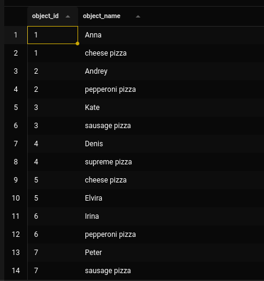
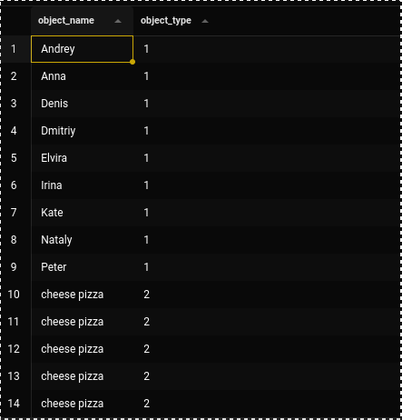
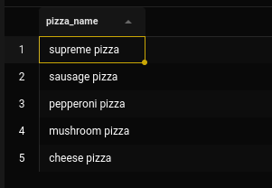
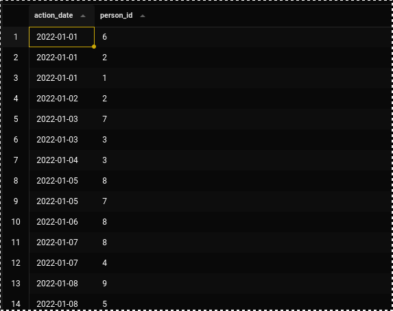
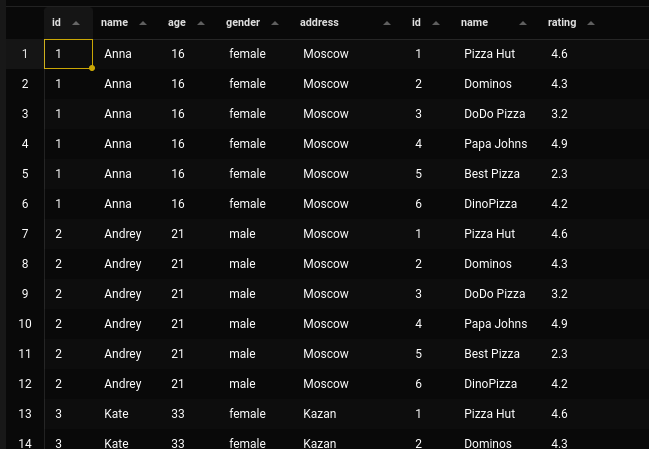
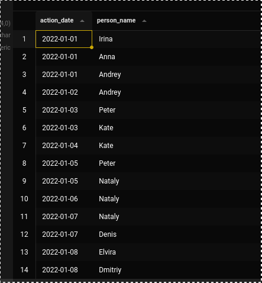
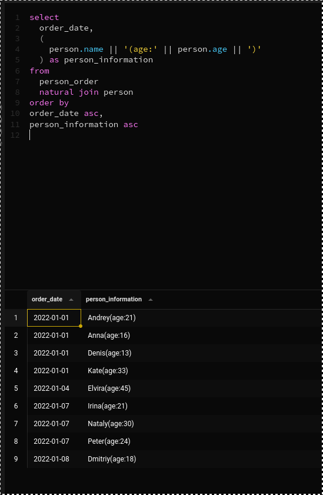
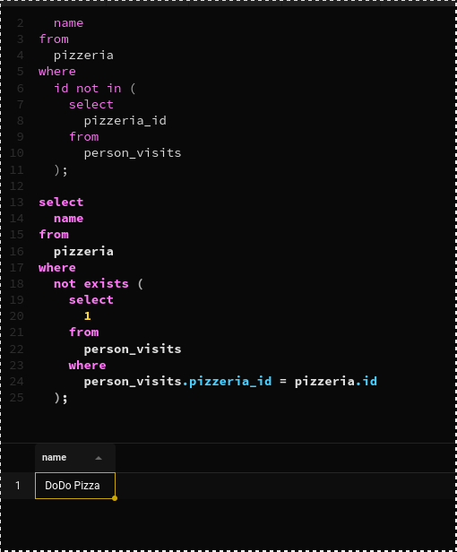
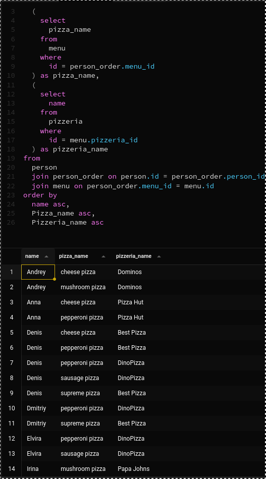

# Выполнил *Самойлов Кирилл*
## Exercise 00 - Let’s make UNION dance
Please write a SQL statement which returns menu’s identifier and pizza names from `menu` table and person’s identifier and person name from `person` table in one global list (with column names as presented on a sample below) ordered by object_id and then by object_name columns.
```sql
select 
  id as object_id, 
  pizza_name as object_name 
from 
  menu 
union 
select 
  id as object_id, 
  name as object_name 
from 
  person 
order by 
  object_id, 
  object_name
```



## Exercise 01 - UNION dance with subquery
Please modify a SQL statement from “exercise 00” by removing the object_id column. Then change ordering by object_name for part of data from the `person` table and then from `menu` table (like presented on a sample below). Please save duplicates!

```sql
select 
  object_name, 
  object_type 
from (
  select 
    pizza_name as object_name,
    2 as object_type
  from 
    menu 
  union all
  select 
    name as object_name,
    1 as object_type
  from 
    person 
) as combined
order by 
  object_type, 
  object_name;
```



## Exercise 02 - Duplicates or not duplicates
Please write a SQL statement which returns unique pizza names from the `menu` table and orders them by pizza_name column in descending mode. Please pay attention to the Denied section.

```sql
select pizza_name
from (
    select pizza_name,
           row_number() over (partition by pizza_name order by pizza_name) as rn
    from menu
) as unique_pizzas
where rn = 1
order by pizza_name desc;
```



## Exercise 03 - “Hidden” Insights
Please write a SQL statement which returns common rows for attributes order_date, person_id from `person_order` table from one side and visit_date, person_id from `person_visits` table from the other side (please see a sample below). In other words, let’s find identifiers of persons, who visited and ordered some pizza on the same day. Actually, please add ordering by action_date in ascending mode and then by person_id in descending mode.

```sql
select 
  action_date, 
  person_id 
from 
  (
    select 
      person_id as person_id, 
      order_date as action_date 
    from 
      person_order 
    union 
    select 
      person_id as person_id, 
      visit_date as action_date 
    from 
      person_visits
  ) 
order by 
  action_date asc, 
  person_id desc
```



## Exercise 04 - Difference? Yep, let's find the difference between multisets.
Please write a SQL statement which returns a difference (minus) of person_id column values with saving duplicates between `person_order` table and `person_visits` table for order_date and visit_date are for 7th of January of 2022

```sql
select 
  person_id 
from 
  person_order 
where 
  order_date = '2022-01-07' 
except 
  all 
select 
  person_id 
from 
  person_visits 
where 
  visit_date = '2022-01-07'
```


## Exercise 05 - Did you hear about Cartesian Product?
Please write a SQL statement which returns all possible combinations between `person` and `pizzeria` tables and please set ordering by person identifier and then by pizzeria identifier columns. Please take a look at the result sample below. Please be aware column's names can be different for you.

```sql
select 
  * 
from 
  person cross 
  join pizzeria 
order by 
  person.id, 
  pizzeria.id
```



## Exercise 06 - Lets see on “Hidden” Insights
Let's return our mind back to exercise #03 and change our SQL statement to return person names instead of person identifiers and change ordering by action_date in ascending mode and then by person_name in descending mode. Please take a look at a data sample below.

```sql
select 
  action_date, 
  person_name 
from 
  (
    select 
      person.name as person_name, 
      person_order.order_date as action_date 
    from 
      person_order 
      join person on person_order.person_id = person.id 
    union 
    select 
      person.name as person_name, 
      person_visits.visit_date as action_date 
    from 
      person_visits 
      join person on person_visits.person_id = person.id
  ) 
order by 
  action_date asc, 
  person_name desc
```



## Exercise 07 - Just make a JOIN
Please write a SQL statement which returns the date of order from the `person_order` table and corresponding person name (name and age are formatted as in the data sample below) which made an order from the `person` table. Add a sort by both columns in ascending mode.

```sql
select 
  order_date, 
  (
    person.name || '(age:' || person.age || ')'
  ) as person_information 
from 
  person_order 
  join person on person_order.person_id = person.id
  order by order_date asc, person_information asc
```


## Exercise 08 - Migrate JOIN to NATURAL JOIN
Please rewrite a SQL statement from exercise #07 by using NATURAL JOIN construction. The result must be the same like for exercise #07.

```sql
select 
  order_date, 
  (
    person.name || '(age:' || person.age || ')'
  ) as person_information 
from 
  person_order 
  natural join person
order by 
order_date asc, 
person_information asc
```


## Exercise 09 - IN versus EXISTS
Please write 2 SQL statements which return a list of pizzerias names which have not been visited by persons by using IN for 1st one and EXISTS for the 2nd one.

```sql
select 
  name 
from 
  pizzeria 
where 
  id not in (
    select 
      pizzeria_id 
    from 
      person_visits
  );
  
select 
  name 
from 
  pizzeria 
where 
  not exists (
    select 
      1 
    from 
      person_visits 
    where 
      person_visits.pizzeria_id = pizzeria.id
  );
```



## Exercise 10 - Global JOIN
Please write a SQL statement which returns a list of the person names which made an order for pizza in the corresponding pizzeria. 
The sample result (with named columns) is provided below and yes ... please make ordering by 3 columns (`person_name`, `pizza_name`, `pizzeria_name`) in ascending mode.

```sql
select 
  name, 
  (
    select 
      pizza_name 
    from 
      menu 
    where 
      id = person_order.menu_id
  ) as pizza_name, 
  (
    select 
      name 
    from 
      pizzeria 
    where 
      id = menu.pizzeria_id
  ) as pizzeria_name 
from 
  person 
  join person_order on person.id = person_order.person_id 
  join menu on person_order.menu_id = menu.id 
order by 
  name asc, 
  Pizza_name asc, 
  Pizzeria_name asc
```


