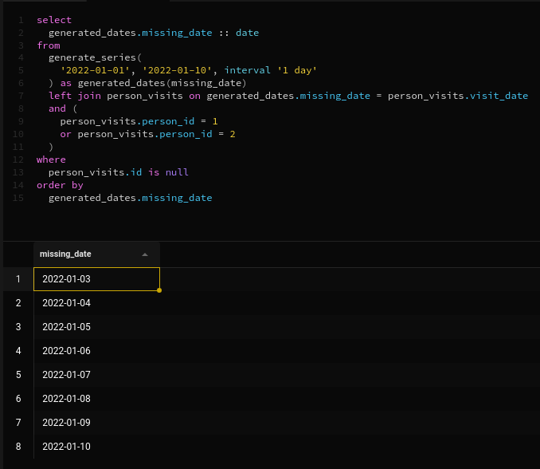
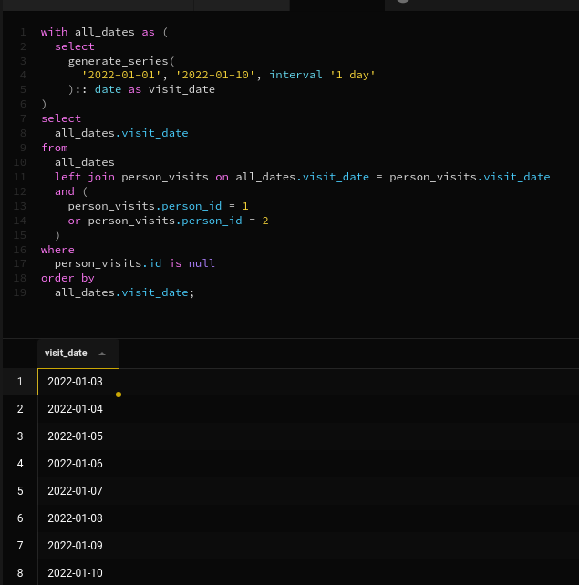

# Выполнил *Самойлов Кирилл*
## Exercise 00 - Move to the LEFT, move to the RIGHT
Please write a SQL statement which returns a list of pizzerias names with corresponding rating value which have not been visited by persons. 

```sql
select 
  name, 
  rating 
from 
  pizzeria 
  left join person_visits on pizzeria.id = person_visits.pizzeria_id 
where 
  person_visits.pizzeria_id is null
```


## Exercise 01 - Find data gaps
Please write a SQL statement which returns the missing days from 1st to 10th of January 2022 (including all days) for visits  of persons with identifiers 1 or 2 (it means days missed by both). Please order by visiting days in ascending mode. The sample of data with column name is presented below.

```sql
select 
  generated_dates.missing_date :: date 
from 
  generate_series(
    '2022-01-01', '2022-01-10', interval '1 day'
  ) as generated_dates(missing_date) 
  left join person_visits on generated_dates.missing_date = person_visits.visit_date 
  and (
    person_visits.person_id = 1 
    or person_visits.person_id = 2
  ) 
where 
  person_visits.id is null 
order by 
  generated_dates.missing_date
```



## Exercise 02 - FULL means ‘completely filled’
Please write a SQL statement that returns a whole list of person names visited (or not visited) pizzerias during the period from 1st to 3rd of January 2022 from one side and the whole list of pizzeria names which have been visited (or not visited) from the other side. The data sample with needed column names is presented below. Please pay attention to the substitution value ‘-’ for `NULL` values in `person_name` and `pizzeria_name` columns. Please also add ordering for all 3 columns.

```sql
select 
  coalesce(person.name, '-') as person_name, 
  person_visits.visit_date, 
  coalesce(pizzeria.name, '-') as pizzeriaeria_name 
from 
  person cross 
  join pizzeria 
  left join person_visits on person.id = person_visits.person_id 
  and pizzeria.id = person_visits.pizzeria_id 
  and person_visits.visit_date between '2022-01-01' 
  and '2022-01-03' 
order by 
  person_name, 
  visit_date, 
  pizzeriaeria_name;
```


## Exercise 03 - Reformat to CTE
Let’s return back to Exercise #01, please rewrite your SQL by using the CTE (Common Table Expression) pattern. Please move into the CTE part of your "day generator". The result should be similar like in Exercise #01

```sql
with all_dates as (
  select 
    generate_series(
      '2022-01-01', '2022-01-10', interval '1 day'
    ):: date as visit_date
) 
select 
  all_dates.visit_date 
from 
  all_dates 
  left join person_visits on all_dates.visit_date = person_visits.visit_date 
  and (
    person_visits.person_id = 1 
    or person_visits.person_id = 2
  ) 
where 
  person_visits.id is null 
order by 
  all_dates.visit_date;
```



## Exercise 04 - Find favourite pizzas
Find full information about all possible pizzeria names and prices to get mushroom or pepperoni pizzas. Please sort the result by pizza name and pizzeria name then. The result of sample data is below (please use the same column names in your SQL statement).

```sql
select pizza_name,
       pizzeria.name as pizzeria_name,
       price
from menu
    join pizzeria
        on pizzeria.id = menu.pizzeria_id
where pizza_name = 'mushroom pizza'
      or pizza_name = 'pepperoni pizza'
order by pizza_name,
         pizzeria_name
```


## Exercise 05 - Investigate Person Data
Find names of all female persons older than 25 and order the result by name. The sample of output is presented below.

```sql
select name
from person
where gender = 'female'
      and age > 25
order by name
```


## Exercise 06 - favourite pizzas for Denis and Anna
Please find all pizza names (and corresponding pizzeria names using `menu` table) that Denis or Anna ordered. Sort a result by both columns. The sample of output is presented below.

```sql
select menu.pizza_name,
       pizzeria.name as pizzeria_name
from person_order person_order
    join menu
        on person_order.menu_id = menu.id
    join person
        on person_order.person_id = person.id
    join pizzeria
        on menu.pizzeria_id = pizzeria.id
where person.name in ( 'Denis', 'Anna' )
order by pizza_name,
         pizzeria_name;
```


## Exercise 07 - Cheapest pizzeria for Dmitriy
Please find the name of pizzeria Dmitriy visited on January 8, 2022 and could eat pizza for less than 800 rubles.

```sql
select pizzeria.name as pizzeria_name
from person_visits
    join person
        on person_visits.person_id = person.id
    join menu
        on person_visits.pizzeria_id = menu.pizzeria_id
    join pizzeria
        on menu.pizzeria_id = pizzeria.id
where person.name = 'Dmitriy'
      and person_visits.visit_date = '2022-01-08'
      and menu.price < 800
```


## Exercise 08 - Continuing to research data
Please find the names of all males from Moscow or Samara cities who orders either pepperoni or mushroom pizzas (or both) . Please order the result by person name in descending mode. The sample of output is presented below.

```sql
select distinct
    p.name
from person p
    join person_order po
        on p.id = po.person_id
    join menu m
        on po.menu_id = m.id
where p.gender = 'male'
      and p.address in ( 'Moscow', 'Samara' )
      and m.pizza_name in ( 'pepperoni pizza', 'mushroom pizza' )
order by p.name desc
```


## Exercise 09 - Who loves cheese and pepperoni?
Please find the names of all females who ordered both pepperoni and cheese pizzas (at any time and in any pizzerias). Make sure that the result is ordered by person name. The sample of data is presented below.

```sql
select person.name
from person
    join person_order
        on person.id = person_order.person_id
    join menu
        on person_order.menu_id = menu.id
where menu.pizza_name = 'pepperoni pizza'
      and person.gender = 'female'
      and person.id in (
                           select person2.id
                           from person person2
                               join person_order person_order2
                                   on person2.id = person_order2.person_id
                               join menu menu2
                                   on person_order2.menu_id = menu2.id
                           where menu2.pizza_name = 'cheese pizza'
                                 and person2.gender = 'female'
                       )
order by person.name
```


## Exercise 10 - Find persons from one city
Please find the names of persons who live on the same address. Make sure that the result is ordered by 1st person, 2nd person's name and common address. The  data sample is presented below. Please make sure your column names are corresponding column names below.

```sql
select p1.name as person_name1,
       p2.name as person_name2,
       p1.address as common_address
from person p1
    join person p2
        on p1.address = p2.address
           and p1.name < p2.name
order by person_name1,
         person_name2,
         common_address
```

