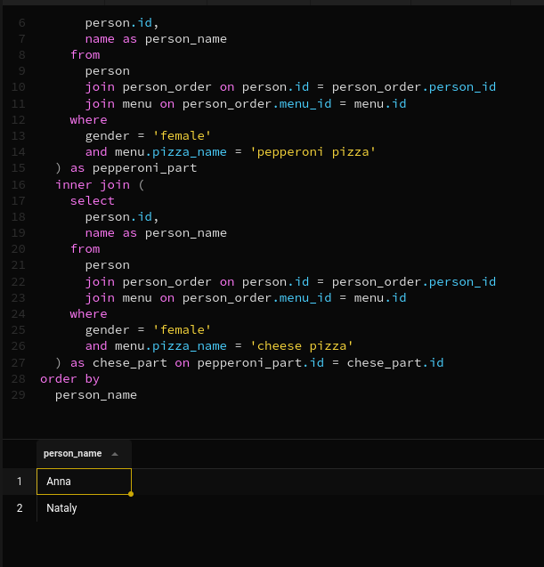

## Exercise 00 - Move to the LEFT, move to the RIGHT
Please write a SQL statement which returns a list of pizzerias names with corresponding rating value which have not been visited by persons.

```sql
select 
  name, 
  rating 
from 
  pizzeria 
  left join person_visits on pizzeria.id = person_visits.pizzeria_id 
where 
  person_visits.person_id is null
```


## Exercise 01 - Find data gaps
Please write a SQL statement which returns the missing days from 1st to 10th of January 2022 (including all days) for visits  of persons with identifiers 1 or 2 (it means days missed by both). Please order by visiting days in ascending mode. The sample of data with column name is presented below.

```sql
select 
  all_dates.visit_date as mising_date 
from 
  (
    select 
      distinct visit_date 
    from 
      person_visits
  ) all_dates 
  left join (
    select 
      distinct visit_date 
    from 
      person_visits 
    where 
      person_id = 1 
      or person_id = 2
  ) person_dates on all_dates.visit_date = person_dates.visit_date 
where 
  person_dates.visit_date is null 
  and all_dates.visit_date is not null
order by 
	mising_date asc
```


## Exercise 02 - FULL means ‘completely filled’
Please write a SQL statement that returns a whole list of person names visited (or not visited) pizzerias during the period from 1st to 3rd of January 2022 from one side and the whole list of pizzeria names which have been visited (or not visited) from the other side. The data sample with needed column names is presented below. Please pay attention to the substitution value ‘-’ for `NULL` values in `person_name` and `pizzeria_name` columns. Please also add ordering for all 3 columns.

```sql
select 
  coalesce(person_names.name, '-') as person_name, 
  visit_date, 
  coalesce(pizzeria_names.name, '-') as pizzeria_name 
from 
  person_visits full 
  outer join (
    select 
      name, 
      fragment1.person_id as person_id 
    from 
      person 
      join (
        select 
          person_id 
        from 
          person_visits 
        where 
          visit_date >= '2022-01-01' 
          and visit_date <= '2022-01-03'
      ) fragment1 on person.id = fragment1.person_id
  ) person_names on person_visits.person_id = person_names.person_id full 
  outer join (
    select 
      name, 
      fragment2.pizzeria_id as pizzeria_id 
    from 
      pizzeria 
      join (
        select 
          pizzeria_id 
        from 
          person_visits 
        where 
          visit_date >= '2022-01-01' 
          and visit_date <= '2022-01-03'
      ) fragment2 on pizzeria.id = fragment2.pizzeria_id
  ) pizzeria_names on person_visits.pizzeria_id = pizzeria_names.pizzeria_id 
order by 
  person_name, 
  pizzeria_name, 
  visit_date
```


## Exercise 03 - Reformat to CTE
Let’s return back to Exercise #01, please rewrite your SQL by using the CTE (Common Table Expression) pattern. Please move into the CTE part of your "day generator". The result should be similar like in Exercise #01

```sql
with select_dates as (
  select 
    distinct visit_date, 
    person_id 
  from 
    person_visits
) 
select 
  all_dates.visit_date as mising_date 
from 
  (
    select 
      visit_date 
    from 
      select_dates
  ) all_dates 
  left join (
    select 
      visit_date, 
      person_id 
    from 
      select_dates 
    where 
      person_id = 1 
      or person_id = 2
  ) person_dates on all_dates.visit_date = person_dates.visit_date 
where 
  person_dates.visit_date is null 
  and all_dates.visit_date is not null 
order by 
  mising_date asc
```


## Exercise 04 - Find favourite pizzas
Find full information about all possible pizzeria names and prices to get mushroom or pepperoni pizzas. Please sort the result by pizza name and pizzeria name then. The result of sample data is below (please use the same column names in your SQL statement).

```sql
select 
  pizza_name, 
  pizzeria.name as pizzeria_name, 
  price 
from 
  menu 
  join pizzeria on menu.pizzeria_id = pizzeria.id 
where 
  pizza_name = 'pepperoni pizza' 
  or pizza_name = 'mushroom pizza' 
order by 
  pizza_name, 
  pizzeria_name
```


## Exercise 05 - Investigate Person Data
Find names of all female persons older than 25 and order the result by name. The sample of output is presented below.

```sql
select 
  name 
from 
  person 
where 
  age >= 25 
  and gender = 'female'

```


## Exercise 06 - favourite pizzas for Denis and Anna
Please find all pizza names (and corresponding pizzeria names using `menu` table) that Denis or Anna ordered. Sort a result by both columns. The sample of output is presented below.

```sql
select 
  pizza_name, 
  pizzeria.name as pizzeria_name 
from 
  menu 
  join pizzeria on menu.pizzeria_id = pizzeria.id 
  inner join (
    select 
      menu_id 
    from 
      person_order 
      join person on person_order.person_id = person.id 
    where 
      person.name = 'Denis' 
      or person.name = 'Anna'
  ) as condition_table on menu.id = condition_table.menu_id 
order by 
  pizza_name, 
  pizzeria_name
```


## Exercise 07 - Cheapest pizzeria for Dmitriy
Please find the name of pizzeria Dmitriy visited on January 8, 2022 and could eat pizza for less than 800 rubles.

```sql
select 
  pizzeria.name as pizzeria_name 
from 
  pizzeria 
  join person_visits on pizzeria.id = person_visits.pizzeria_id 
  join person on person_visits.person_id = person.id 
  join menu on pizzeria.id = menu.pizzeria_id 
where 
  person.name = 'Dmitriy' 
  and person_visits.visit_date = '2022-01-08' 
  and menu.price < 800
```


## Exercise 08 - Continuing to research data
Please find the names of all males from Moscow or Samara cities who orders either pepperoni or mushroom pizzas (or both) . Please order the result by person name in descending mode. The sample of output is presented below.

```sql
select 
  name 
from 
  person 
  join person_order on person.id = person_order.person_id 
  join menu on person_order.menu_id = menu.id 
where 
  gender = 'male' 
  and (
    address = 'Moscow' 
    or address = 'Samara'
  ) 
  and (
    menu.pizza_name = 'pepperoni pizza' 
    or menu.pizza_name = 'mushroom pizza'
  ) 
order by 
  name desc
```


## Exercise 09 - Who loves cheese and pepperoni?
Please find the names of all females who ordered both pepperoni and cheese pizzas (at any time and in any pizzerias). Make sure that the result is ordered by person name. The sample of data is presented below.

```sql
select 
  pepperoni_part.person_name 
from 
  (
    select 
      person.id, 
      name as person_name 
    from 
      person 
      join person_order on person.id = person_order.person_id 
      join menu on person_order.menu_id = menu.id 
    where 
      gender = 'female' 
      and menu.pizza_name = 'pepperoni pizza'
  ) as pepperoni_part 
  inner join (
    select 
      person.id, 
      name as person_name 
    from 
      person 
      join person_order on person.id = person_order.person_id 
      join menu on person_order.menu_id = menu.id 
    where 
      gender = 'female' 
      and menu.pizza_name = 'cheese pizza'
  ) as chese_part on pepperoni_part.id = chese_part.id 
order by 
  person_name
```



## Exercise 10 - Find persons from one city
Please find the names of persons who live on the same address. Make sure that the result is ordered by 1st person, 2nd person's name and common address. The  data sample is presented below. Please make sure your column names are corresponding column names below.

```sql
select 
  person_name1, 
  person_name2, 
  part1.common_address 
from 
  (
    select 
      id, 
      name as person_name1, 
      address as common_address 
    from 
      person
  ) as part1 
  join (
    select 
      id, 
      name as person_name2, 
      address as common_address 
    from 
      person
  ) as part2 on part1.common_address = part2.common_address 
where 
  person_name1 != person_name2 
  and part1.common_address = part2.common_address 
order by 
  person_name1, 
  person_name2, 
  common_address
```

